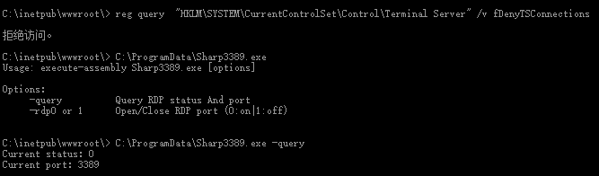
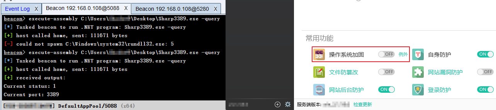

# sharp3389
* 目标框架：.NET Framework 2.0
* 根据冷逸老哥写的“[开3389工具](https://github.com/lengjibo/RedTeamTools/tree/master/windows/%E5%BC%803389%E5%B7%A5%E5%85%B7)”用C#也写了一个，可用CobaltStrike execute-assembly加载到内存中实现无落地执行。
* 工具原理：利用Windows的RegCreateKeyEx和RegSetValueEx两个API和RegistryKey类来操作系统注册表，与无Net.exe添加管理员用户一样，都是直接利用的Windows API执行相应操作。

### 应用场景1：
目标主机因存在某安全防护软件而无法用reg、wmic等命令开启3389端口时，可以尝试使用这两款工具来开启3389端口。

### 应用场景2：
目标主机上的安全防护软件（如：某锁）拦截rundll32.exe时则不能用execute-assembly加载到内存执行，只能落地执行。

### 参考链接：
* https://docs.microsoft.com/zh-cn/dotnet/api/microsoft.win32
* https://docs.microsoft.com/zh-cn/dotnet/api/microsoft.win32.registrykeypermissioncheck
* https://blog.csdn.net/zjlovety/article/details/38707333
* https://www.cnblogs.com/springsnow/p/9434010.html
* https://wenku.baidu.com/view/c72718b459f5f61fb7360b4c2e3f5727a4e92410.html
* https://www.c-sharpcorner.com/uploadfile/puranindia/the-windows-registry-in-C-Sharp/
